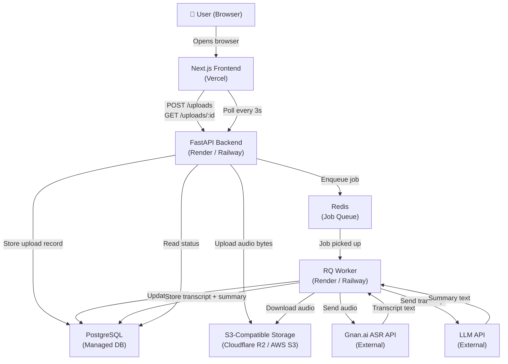

# Architecture

## Goal

Define exactly how the pieces of the Audio Notes Platform fit together.

## Why do we need an architecture document?

Before writing code, we need a blueprint. This document explains:
- What each component is responsible for
- How components talk to each other
- Why we chose each technology

---

## Full System Diagram



---

## Component Responsibilities

### Next.js Frontend

**What it does:** Displays the UI. Handles file selection, upload, and polling.

**What it does NOT do:** Never talks to Gnan.ai, LLM, S3, Redis, or PostgreSQL directly. It only talks to FastAPI.

**Why Next.js?**
- Simple React framework with built-in routing
- Easy to deploy to Vercel
- JavaScript keeps the stack simple (no TypeScript required)

---

### FastAPI Backend

**What it does:**
- Receives the uploaded audio file
- Validates the file
- Uploads it to S3
- Creates a database record
- Enqueues a background job in Redis
- Returns the upload ID immediately

**What it does NOT do:** Does not call Gnan.ai or the LLM — that is the worker's job.

**Why FastAPI?**
- Python — same language as the worker
- Extremely fast to write
- Automatic API documentation at `/docs`
- Clean async support

---

### PostgreSQL

**What it stores:** One `uploads` table with status, transcript, summary, error_message, etc.

**Why PostgreSQL?**
- Industry-standard relational database
- Easy to manage on Render/Railway
- SQLAlchemy ORM makes queries readable

---

### S3-Compatible Object Storage

**What it stores:** The raw audio file bytes.

**Why not store audio in PostgreSQL?**
- Databases are not designed for binary blobs
- Object storage is cheap and scales to any file size
- Audio files can be 10–100+ MB; that would bloat the DB

**Why S3-compatible?**
- Cloudflare R2 has a generous free tier
- AWS S3 is the industry standard
- The boto3 library works with any S3-compatible provider

---

### Redis

**What it does:** Acts as the job queue. FastAPI writes a job message; the RQ worker reads it.

**Why Redis?**
- Fast in-memory store
- RQ (Redis Queue) is the simplest Python job queue library
- Easy to set up on Render/Railway

---

### RQ Worker

**What it does:**
1. Picks up `process_audio(upload_id)` jobs from Redis
2. Downloads the audio from S3
3. Calls Gnan.ai ASR → gets transcript
4. Calls LLM API → gets summary
5. Saves everything to PostgreSQL
6. Updates status at each step

**Why a separate worker?**
- HTTP requests must return quickly (< a few seconds)
- Transcription + summarization can take 30–120 seconds
- The worker runs in the background so the user is not waiting

---

### Gnan.ai ASR API

**What it does:** Converts audio bytes → text transcript.

**Kept isolated in:** `backend/app/services/gnan_service.py`

---

### LLM API

**What it does:** Converts transcript text → structured summary.

**Kept isolated in:** `backend/app/services/summary_service.py`

---

## Data Flow — Step by Step

```
1. User selects lecture.mp3 in browser
2. Browser sends POST /uploads  (multipart form)
3. FastAPI validates file type and size
4. FastAPI uploads bytes to S3 → key: uploads/abc123/lecture.mp3
5. FastAPI creates DB row: { id: abc123, status: QUEUED, ... }
6. FastAPI enqueues job: process_audio("abc123") → Redis
7. FastAPI returns { id: "abc123", status: "QUEUED" }
8. Browser starts polling GET /uploads/abc123 every 3 seconds
9. RQ Worker picks up the job
10. Worker sets status = TRANSCRIBING, progress = 30
11. Worker downloads audio from S3
12. Worker sends audio to Gnan.ai
13. Gnan.ai responds with transcript text
14. Worker stores transcript in DB, sets progress = 70
15. Worker sets status = SUMMARIZING, progress = 75
16. Worker sends transcript to LLM
17. LLM responds with summary
18. Worker stores summary, sets status = COMPLETED, progress = 100
19. Browser polls → sees COMPLETED → displays transcript + summary → stops polling
```

If step 12 fails (e.g., Gnan.ai times out):
```
Worker catches exception
Worker sets status = FAILED, error_message = "Transcription failed. Please try again."
Browser polls → sees FAILED → displays error message → stops polling
```

---

## Folder Structure (Final)

```
audio-notes/
│
├── frontend/                    # Next.js application
│   ├── app/
│   │   ├── page.js              # Main upload page
│   │   └── layout.js
│   ├── components/
│   │   ├── UploadForm.js        # File picker + upload button
│   │   ├── StatusPanel.js       # Progress bar + status display
│   │   └── ResultsPanel.js      # Transcript + summary display
│   ├── lib/
│   │   └── api.js               # All fetch() calls to backend
│   ├── package.json
│   └── .env.local.example
│
├── backend/
│   ├── app/
│   │   ├── main.py              # FastAPI app entry point
│   │   ├── database.py          # SQLAlchemy connection
│   │   ├── models.py            # Upload SQLAlchemy model
│   │   ├── schemas.py           # Pydantic request/response schemas
│   │   ├── routes/
│   │   │   └── uploads.py       # POST /uploads, GET /uploads/{id}
│   │   └── services/
│   │       ├── storage_service.py   # S3 upload/download/delete
│   │       ├── gnan_service.py      # Gnan.ai ASR calls
│   │       └── summary_service.py   # LLM summarization calls
│   │
│   ├── worker.py                # RQ job: process_audio()
│   ├── requirements.txt
│   └── .env.example
│
├── docs/
│   ├── 00-requirements.md
│   ├── 01-project-setup.md
│   ├── 02-database.md
│   ├── 03-file-upload.md
│   ├── 04-object-storage.md
│   ├── 05-background-jobs.md
│   ├── 06-gnan-transcription.md
│   ├── 07-summarization.md
│   ├── 08-frontend-status.md
│   ├── 09-error-handling.md
│   ├── 10-testing.md
│   ├── 11-deployment.md
│   ├── 12-final-architecture.md
│   ├── API.md
│   ├── ARCHITECTURE.md          # This file
│   ├── INTERVIEW_GUIDE.md
│   └── troubleshooting.md
│
├── .gitignore
└── README.md
```

---

## Technology Choices Summary

| Decision | Choice | Reason |
|----------|--------|--------|
| Frontend framework | Next.js | Simple, Vercel-native, React |
| Backend framework | FastAPI | Fast, Python, auto-docs |
| Database | PostgreSQL | Reliable, hosted easily |
| ORM | SQLAlchemy | Industry standard, readable |
| Object storage | S3-compatible | Scales, cheap, standard |
| Job queue | Redis + RQ | Simple, Python-native |
| Transcription | Gnan.ai ASR | Required by assignment |
| Summarization | LLM API | Isolated, swappable |
| Deployment | Vercel + Render | Free tiers, simple setup |

---

## Interview Explanation

> "The architecture separates concerns clearly. The frontend only talks to FastAPI. FastAPI handles validation and storage, then immediately offloads slow work to a background job queue (Redis/RQ). The RQ worker handles the time-consuming Gnan.ai transcription and LLM summarization. The frontend polls every 3 seconds to check status. This design keeps API response times fast, the UI never freezes, and all external API keys are hidden inside the backend."
